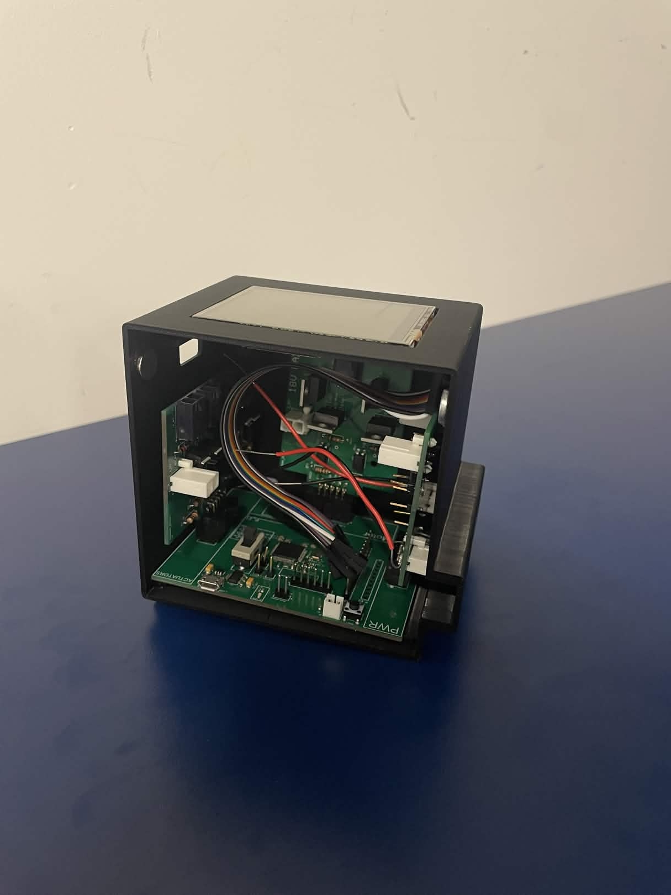
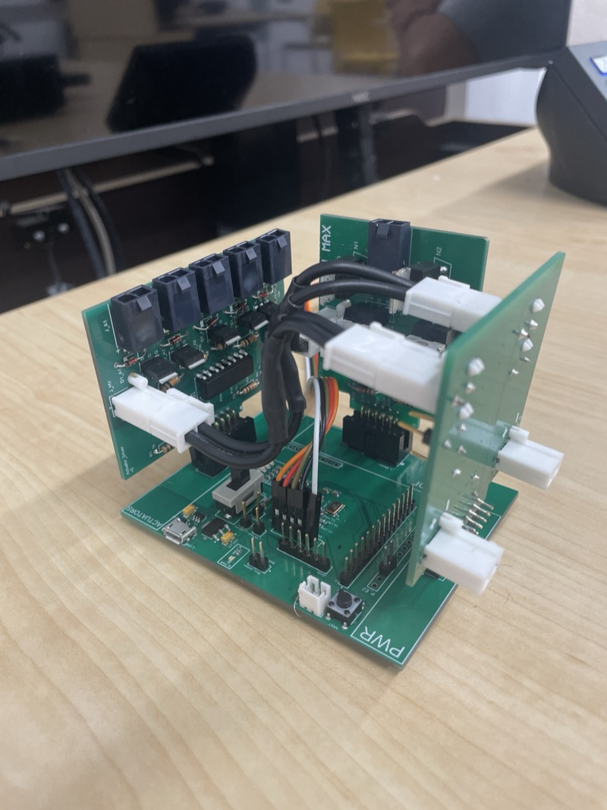
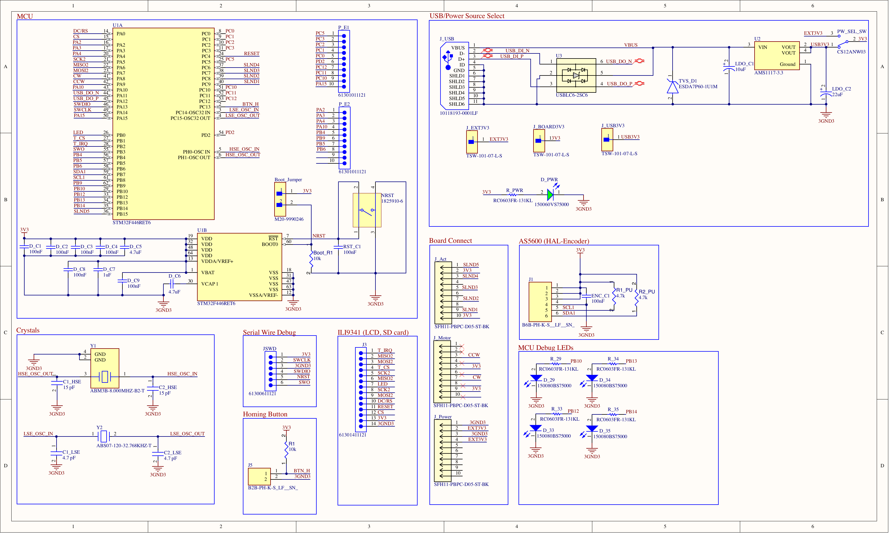
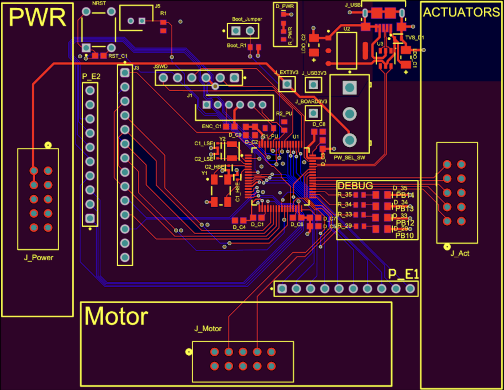
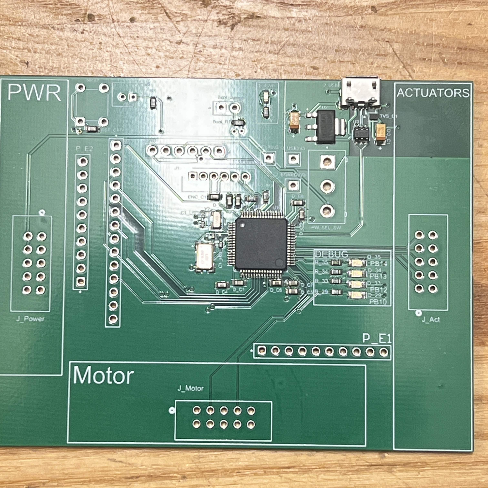

# Piano Robot Motherboard

STM32F446RET6-based motherboard for a piano-playing robot, designed as part of a university design course. This board serves as the central controller, interfacing with three daughter boards via board-to-board connectors:

- **Actuator control board**: drives the solenoid key-pressing mechanisms
- **Motor control board**: controls motors for lateral positioning along the keyboard
- **Power board**: supplies regulated power to the system

The robot successfully played a complete song in its final demonstration.

  
  

  <em>Left: Final system in enclosure with ILI9341 LCD. Right: Motherboard with all three daughter boards connected.</em>

<table>
<tr>
<td align="center" width="50%">
<b>Tuning test</b>  
<video src="https://github.com/user-attachments/assets/381959c6-beb1-4cde-a3b7-1b7397a94e4c" width="100%" controls></video>
</td>
<td align="center" width="50%">
<b>Full performance (Fly Me to the Moon)</b>  
<video src="https://github.com/user-attachments/assets/a43d4908-bae1-4aea-bd88-e41d0c23e8ff" width="100%" controls></video>
</td>
</tr>
</table>

## Schematic

Full schematic PDF: [`schematic/motherboard_final.pdf`](schematic/motherboard_final.pdf)

### MCU: STM32F446RET6 (LQFP64)
- ARM Cortex-M4 with FPU, 180 MHz, 512 KB Flash, 128 KB SRAM
- Chosen for its timer peripherals (motor PWM), ADC channels, and USB OTG FS

### Power Supply
- Dual power source: external 3.3V from power board or USB 5V stepped down via AMS1117-3.3 LDO
- SPDT slide switch (CS12ANW03, break-before-make) selects between the two sources, preventing both from being connected simultaneously
- LDO input: 10uF tantalum, output: 22uF tantalum
- Decoupling follows ST AN4488 recommendations:
  - 4x 100nF (one per VDD pin: 19, 32, 48, 64)
  - 1x 4.7uF bulk cap on VDD
  - 1x 100nF + 1x 1uF on VDDA/VREF+ (pin 13)
  - 1x 4.7uF on VCAP1 (pin 30, internal 1.2V regulator output)
  - 1x 100nF on VBAT (pin 1), tied to VDD with no backup battery
- All VSS/VSSA pins connected to common ground plane
- No PDR_ON or BYPASS_REG pins on LQFP64; internal reset and regulator always enabled (per datasheet Table 4)

### USB (Micro-B, 10118193-0001LF)
- USB OTG FS in device-only mode
- Used for CDC virtual COM port (serial comms) and DFU firmware flashing (via BOOT0 jumper)
- D- (PA11) and D+ (PA12) routed as 90-ohm differential pair
- ESD protection per AN4879 Table 11:
  - USBLC6-2SC6 (SOT-23-6L) on D+/D- data lines, placed close to connector
  - ESDA7P60-1U1M TVS diode on VBUS power line
- USB ID pin tied to GND (device mode)
- USB shield pins tied to GND
- No VBUS sensing; PA9 already used for motor PWM (TIM1_CH2). USB works without it; board is externally powered
- Internal DP pull-up resistor embedded in STM32F446, so no external pull-up needed

### Reset Circuit
- NRST (pin 7) with 100nF filter cap to ground
- Internal 40k pull-up inside the MCU, so no external pull-up resistor needed
- Tact switch (1825910-6, SPST-NO momentary) between NRST and GND for manual reset

### Boot Configuration
- BOOT0 (pin 60) with 10k pull-down to GND, so default boot is from main flash
- 2-pin jumper header (M20-9990246) between BOOT0 and 3V3:
  - Jumper off: boots from flash (normal operation)
  - Jumper on + reset: enters ST built-in bootloader for USB DFU flashing

### Debug: Serial Wire Debug (SWD)
- 6-pin header (2.54mm pitch):
  - Pin 1: 3V3 (VDD_TARGET, voltage reference for ST-LINK, not power supply)
  - Pin 2: SWCLK (PA14)
  - Pin 3: SWDIO (PA13)
  - Pin 4: SWO (PB3), serial debug output via SWV ITM Data Console in CubeIDE
  - Pin 5: NRST
  - Pin 6: GND
- Programmed via Nucleo-F401RE's onboard ST-LINK (CN4 header)
- Remove CN2 jumpers on Nucleo to disconnect its onboard target MCU

### Clocks
- HSE: ABM3B 8 MHz crystal with 2x 15pF load capacitors
- LSE: ABS07-120 32.768 kHz crystal with 2x 4.7pF load capacitors

### Peripherals
- **ILI9341 LCD + SD card**: 14-pin header (SPI + control signals)
- **AS5600 magnetic encoder**: I2C with 4.7k pull-up resistors on SCL/SDA
- **Homing button**: 10k pull-up resistor, active low
- **Debug LEDs**: 4x blue LEDs on PB10, PB12, PB13, PB14 with 1k current-limiting resistors
- **Status LED**: on GPIO
- **Board-to-board connectors**: 3x SFH11-PBPC-D05-ST-BK (10-pin each) for actuator, motor, and power daughter boards
- **SPI header**: 4-pin (SCK2, MISO2, MOSI2, SD_CS)

### GPIO Expansion Headers
Two breakout headers expose spare MCU pins for future peripherals, probing, and debugging:
- **P_E1** (12-pin): PC0, PC1, PC2, PC3, PC4, PC5, PC6, PC7, PD2, PC12, PC10, PA15
- **P_E2** (10-pin): PA2, PA3, PA4, PA10, PB9, PB5, PB6, PB8 + GND

### Motor Interface (via board connector)
- PA8: TIM1_CH1 (PWM signal 1)
- PA9: TIM1_CH2 (PWM signal 2)

## PCB Layout

2-layer board designed in Altium Designer. SMD components hand-soldered using a hot plate.

Key layout decisions:
- Board-to-board connectors (J_Power, J_Motor, J_Act) placed on three edges for vertical daughter board stacking
- USB connector and power switch grouped on the top edge for accessibility
- Decoupling capacitors placed as close to their respective VDD pins as possible
- HSE/LSE crystals placed near MCU oscillator pins with short, symmetric traces
- USB D+/D- routed as a differential pair with ESD protection placed close to the connector
- Debug header and GPIO expansion headers on opposing sides

  

<em>Motherboard after hot plate reflow soldering.</em>

## BOM Summary

| Component | Value | Designator | Qty |
|-----------|-------|------------|-----|
| STM32F446RET6 | LQFP64 | U1 | 1 |
| AMS1117-3.3 | 3.3V LDO | U2 | 1 |
| USBLC6-2SC6 | USB ESD | U3 | 1 |
| ESDA7P60-1U1M | VBUS TVS | TVS_D1 | 1 |
| 100nF ceramic | 0603 | D_C1-C4, D_C8, D_C9, RST_C1 | 7 |
| 4.7uF ceramic | 0603 | D_C5, D_C6 | 2 |
| 1uF ceramic | 0603 | D_C7 | 1 |
| 10uF tantalum | 1206 | LDO_C1 | 1 |
| 22uF tantalum | 1206 | LDO_C2 | 1 |
| 15pF ceramic | 0402 | C1_HSE, C2_HSE | 2 |
| 4.7pF ceramic | 0402 | C1_LSE, C2_LSE | 2 |
| 10k resistor | 0603 | Boot_R1, R1 | 2 |
| 4.7k resistor | 0603 | R1_pullup, R2_pullup | 2 |
| 1k resistor (RC0603FR-131KL) | 0603 | R_29, R_33, R_34, R_35 | 4 |
| 150080BS75000 | Blue LED | D_29, D_33, D_34, D_35 | 4 |
| ABM3B 8MHz | Crystal | Y1 | 1 |
| ABS07 32.768kHz | Crystal | Y2 | 1 |
| 10118193-0001LF | USB Micro-B | J_USB | 1 |
| CS12ANW03 | SPDT switch | PW_SEL_SW | 1 |
| 1825910-6 | Tact switch | NRST | 1 |
| M20-9990246 | 2-pin header | Boot_Jumper | 1 |
| SFH11-PBPC-D05-ST-BK | 10-pin connector | J_Act, J_Motor, J_Power | 3 |

## Design Files

Altium Designer source files are in [`hardware/`](hardware/):

| File | Description |
|------|-------------|
| `Motherboard_stm.PrjPcb` | Altium project file |
| `Motherboard_R2.PcbDoc` | PCB layout (Rev 2) |
| `Interconnect.SchDoc` | Schematic source |
| `Motherboard_stm.BomDoc` | Bill of materials |
| `Motherboard_stm.OutJob` | Output job configuration |

## References
- [STM32F446RE Datasheet (DS10693)](https://www.st.com/resource/en/datasheet/stm32f446re.pdf)
- [AN4488: Getting started with STM32F4 hardware development](https://www.st.com/resource/en/application_note/an4488-getting-started-with-stm32f4xxxx-mcu-hardware-development-stmicroelectronics.pdf)
- [AN4879: USB hardware and PCB guidelines using STM32 MCUs](https://www.st.com/resource/en/application_note/an4879-introduction-to-usb-hardware-and-pcb-guidelines-using-stm32-mcus-stmicroelectronics.pdf)
- [USBLC6-2 Datasheet](https://www.st.com/resource/en/datasheet/usblc6-2.pdf)
- [AMS1117 Datasheet](https://mm.digikey.com/Volume0/opasdata/d220001/medias/docus/5011/AMS1117.pdf)

## Status
Complete. Board was designed, fabricated, assembled (hot plate reflow), and tested. The full system (motherboard + three daughter boards) was integrated into a 3D-printed enclosure and successfully played a song in the final demonstration.
